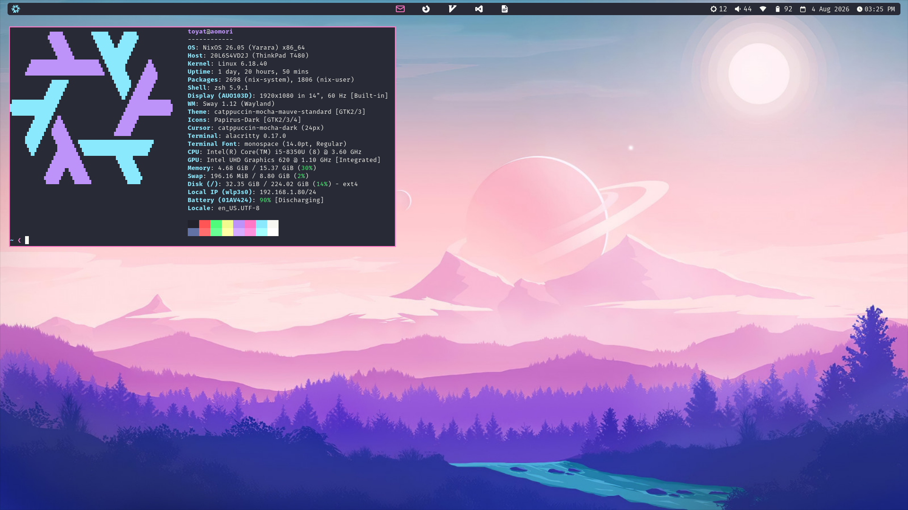
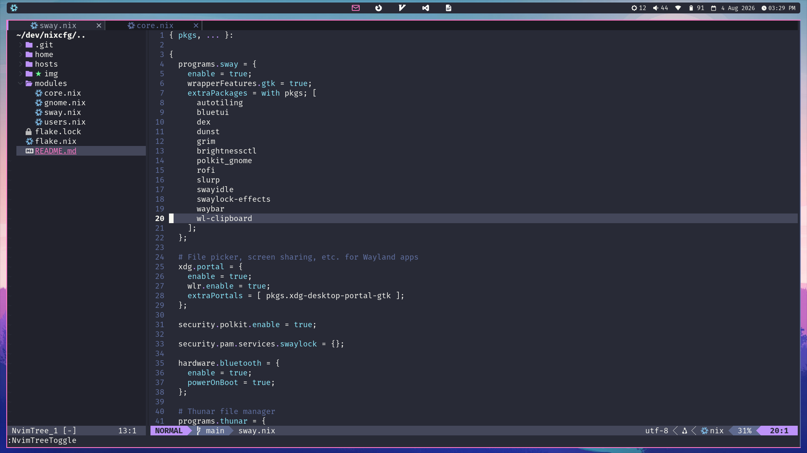

# nixcfg

This repository contains my NixOS and Home Manager configurations that build my systems.

## Screenshots

### Sway





## Usage

If on a non-NixOS system, the first step is to install the [Nix package manager](https://nixos.org/download/).

On any system, install [Home Manager](https://nix-community.github.io/home-manager/installation/standalone.html).
Make sure that the appropriate Home Manager channel is added. You can see which channel is appropriate by checking `flake.nix`.
Once Home Manager is installed, follow the instructions below for your system.

### Adding a New Host

1. Create a new directory in `hosts/` with the hostname as the directory name.

2. Copy `hardware-configuration.nix` from `/etc/nixos/hardware-configuration.nix`:

```
cp /etc/nixos/hardware-configuration.nix ./hosts/<hostname>/hardware-configuration.nix
```

3. Populate `./hosts/<hostname>/default.nix`.

4. Populate `flake.nix` with a new NixOS configuration.

### NixOS

```
sudo nixos-rebuild switch --flake .#<hostname>
```

### Non-NixOS Systems

1. Enable [flakes](https://nixos.wiki/wiki/Flakes) by adding the following to `~/.config/nix/nix.conf`:

```
experimental-features = nix-command flakes
```

2. Install the packages via Nix and Home Manager:

```
home-manager switch --flake .#<config> --impure
```

> Configuration options are `intel`, `nvidia`, or `jetson` depending on the GPU type.

3. Add path to Nix's zsh to `/etc/shells`, which lists valid login shells:

```
echo /home/<username>/.nix-profile/bin/zsh | sudo tee -a /etc/shells
```

4. Change default login shell to Nix's zsh:

```
chsh -s /home/<username>/.nix-profile/bin/zsh
```

## Troubleshooting

### Enter tty from greeter

Press Ctrl+Alt+F3.
